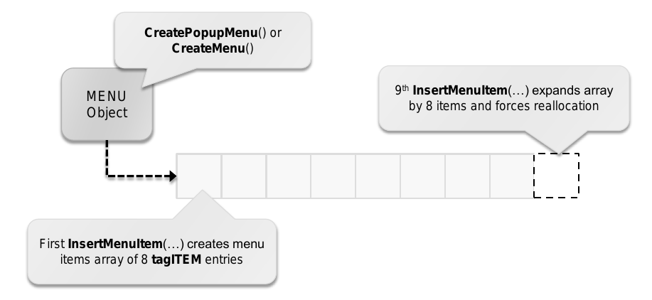
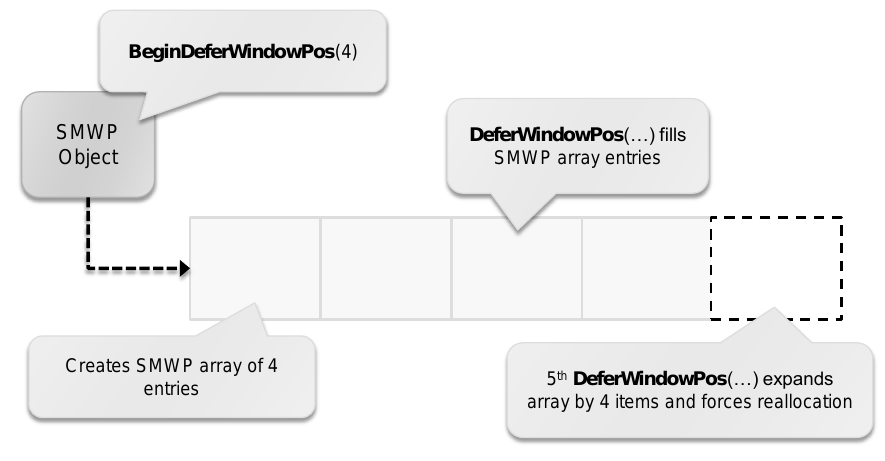

# 3.4. 缓冲区重新分配

许多用户对象都有项数组或者其他形式的缓冲区与之关联。
当元素增加或者移除时，项数组通常会重新确定大小来节省内存。
举个例子，如果元素数目超过或者低于某个特定的阀值，
缓冲区就会重新分配成更合适的大小。同样地，
当数组清空的时候，缓冲区会释放。重要的是，
没能做到的函数可能会操作已经释放的空间，
因而允许攻击者控制赋值锁锁住了的指针或者破坏后续分配的内存。


__图 1__ 缓冲区的重新分配

## 菜单项数组释放后重用漏洞

为了记录弹出菜单或者下拉菜单的菜单项，
菜单对象（win32k!tagMENU）定义了一个指向菜单项数组的指针
（rgItems）。每一个菜单项（win32k!tagITEM）定义类似显示的文字，
嵌入的图片，指向子菜单的指针之类属性。
菜单对象结构体把数组所包含的项数记录在 cItems 变量里，
将能够容纳的项数记录在 cAlloced。在添加或者删除菜单项数组中的元素时，
比如通过调用 InsertMenuItem() 或者 DeleteMenu()，
如果 cAlloced 快要比 cItems 小（__图 2__）
或者当 cItems 与 cAllocated 差距大于 8 时，
Win32k 会尝试重新分配数组的大小。



__图 2__ 菜单项数组的重新分配

几个 Win32k 里的函数没能在用户模式回调函数之后
有效检查菜单项数组缓冲区。由于没有办法给菜单项“加锁”，
就像用户对象的情形那样，任何可能调用用户模式回调函数的函数
都需要重新检查菜单项数组。这同样适用于接受菜单项作为参数的函数。
如果菜单项数组缓冲区被用户模式回调函数重新分配过，
后续的代码可能会操作已经释放的内存或者由攻击者控制的数据。

SetMenuInfo 允许应用程序设置给定菜单的各种属性。
在设置给定菜单信息结构（MENUINFO）的 MIM\_APPLYTOSUBMENUS
标志值时，Win32k 还会将更新应用到菜单的所有子菜单。
这可以在 xxxSetMenuInfo 中观察到，
该函数迭代菜单项的每一项并且递归地处理每一个子菜单来传播更新的设置。
在处理菜单项数组和做递归调用之前，xxxSetMenuInfo 会把菜单项的数目
（cItems）和菜单项数组指针（rgItems）存储到局部变量或者寄存器中
（__清单 15__）。

```
.text:BF89C779           mov       eax, [esi+tagMENU.cItems]
.text:BF89C77C           mov       ebx, [esi+tagMENU.rgItems]
.text:BF89C77F           mov       [ebp+cItems], eax
.text:BF89C782           cmp       eax, edx
.text:BF89C784           jz        short loc_BF89C7CC
```

__清单 15__ 存储菜单项与数组指针

一旦 xxxSetMenuInfo 达到了最内层的菜单，递归停止，
这一项就处理完了。这时候，该函数可能在调用 xxxMNUpdateShownMenu
的时候调用一个用户模式回调函数，这可能使得菜单项数组的大小重新分配。
然而，当 xxxMNUpdateShownMenu 返回并且从递归调用返回时，
xxxSetMenuInfo 没能正确的检查菜单项数组缓冲区与数组中含有的项数。
如果攻击者在 xxxMNUpdateShownMenu 调用的那个用户模式回调函数里通过调用
InsertMenuItem() 或者 DeleteMenu() 重新分配菜单项数组的大小，
那么 __清单 16__ 中的 ebx 就肯能指向已经释放的内存。
另外，由于 cItems 记录着数组在该函数被调用的时候的项数，
xxxSetMenuInfo 可能会操作到已分配数组的外面。

```
.text:BF89C786           add       ebx, tagITEM.spSubMenu
.text:BF89C789           mov       eax, [ebx]           ; spSubMenu
.text:BF89C78B           dec       [ebp+cItems]
.text:BF89C78E           cmp       eax, edx
.text:BF89C790           jz        short loc_BF89C7C4
...
.text:BF89C7B2           push      edi
.text:BF89C7B3           push      dword ptr [ebx]
.text:BF89C7B5           call      _xxxSetMenuInfo@8 ; xxxSetMenuInfo(x,x)
.text:BF89C7BA           call      _ThreadUnlock1@0 ; ThreadUnlock1()
.text:BF89C7BF           xor       ecx, ecx
.text:BF89C7C1           inc       ecx
.text:BF89C7C2           xor       edx, edx
...
.text:BF89C7C4           add       ebx, 6Ch             ; next menu item
.text:BF89C7C7           cmp       [ebp+cItems], edx ; more items ?
.text:BF89C7CA           jnz       short loc_BF89C789
```

__清单 16__ 在用户模式回调函数之后的不足够的缓冲区检查

为了处理与菜单项有关的漏洞，微软在 Win32k 里引入了一个新的
MNGetpItemFromIndex 函数。
该函数接受菜单对象指针与请求的菜单项索引为参数，
根据菜单对象提供的信息返回一个菜单项

## SetWindowPos 数组释放后重用漏洞

Windows 允许应用程序延迟窗口位置的更新，为了实现这个，
Windows 使用一个特殊的包含指向窗口位置指针数组的
SetWindowPos 对象。在应用程序调用 BeginDeferWindowPos() 的时候，
SWP 对象与这个数组会初始化。该函数接受数组元素（窗口位置结构）
的个数来预先分配空间。通过调用 DeferWindowPos()，
在该函数中下一个可用的位置结构会填充好，
窗口位置更新就这样延迟了。如果请求的延迟更新数目超过预先分配的数目，
Win32k 会重新分配该数组到一个更合适的大小（多出 4 个项）。
一旦所有的请求的窗口位置更新都延迟了，
应用程序调用 EndDeferWindowPos() 来处理需要更新的窗口列表。



__图 3__ SWP 数组重新分配（__译者注 1__）

译者注 1：作者原文突然出现了“SMWP”四个字母的缩写，
译者认为是 SWP 的笔误，一并予以纠正为 SWP（图片里的没法纠正，
依旧还是 SMWP）。

在操作 SWP 数组的时候，Win32k
在用户模式回调函数之后没能总是正确地检查数组指针。
在调用 EndDeferWindowPos 来处理多个窗口位置结构时，
Win32k 调用 xxxCalcValidRects 来计算每一个在
SMP 数组中引用了的窗口的位置与大小。该函数迭代其中的每一项，
执行各种操作，比如通知每一个的窗口它的位置正在变化
（WM\_WINDOWPOSCHANGING）。因为这个消息可能调用用户模式回调函数，
为了使 SWP 数组重新分配大小（__清单 17__），
攻击着可能对同一个 SWP 对象多次调用 DeferWindowPos。
这结果就会导致释放后重用，因为 xxxCalcValidRects 会把窗口句柄
写回原来的缓冲区。

```
.text:BF8A37B8           mov      ebx, [esi+14h] ; SWP array
.text:BF8A37BB           mov      [ebp+var_20], 1
.text:BF8A37C2           mov      [ebp+cItems], eax ; SWP array count
.text:BF8A37C5           js       loc_BF8A3DE3       ; exit if no entries
...
.text:BF8A3839           push     ebx
.text:BF8A383A           push     eax
.text:BF8A383B           push     WM_WINDOWPOSCHANGING
.text:BF8A383D           push     esi
.text:BF8A383E           call     _xxxSendMessage@16 ; user-mode callback
.text:BF8A3843           mov      eax, [ebx+4]
.text:BF8A3846           mov      [ebx], edi            ; window handle
...
.text:BF8A3DD7           add      ebx, 60h              ; get next entry
.text:BF8A3DDA           dec      [ebp+cItems]          ; decrement cItems
.text:BF8A3DDD           jns      loc_BF8A37CB
```

__清单 17__ 在 xxxCalcValidRects 里的不充分的指针与大小检查

不同于菜单项，与 SWP 数组处理相关的漏洞的修复是通过
SWP 数组正在被处理的时候禁用缓冲区重新分配实现地。
这可以在 win32k!DeferWindowPos 观察到，
该函数检查一个“正在被处理”的标志，然后只允许不造成缓冲区重新分配的项添加。
