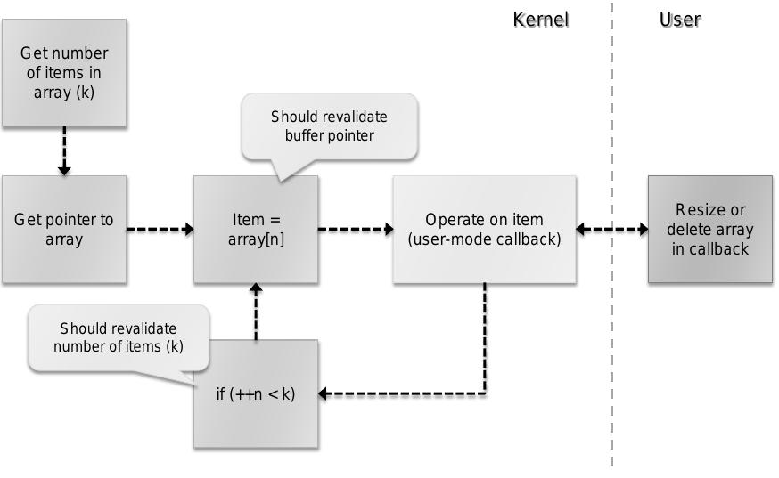

基于用户模式回调函数的内核漏洞分析、利用与防范
==============================================

**Tarjei Mandt**

**Norman Threat Research**

**译者** ：rectigu@gmail.com

**创建时间** ：2015 年 7 月

**更新时间** ：2016 年 4 月 27 日

**摘要** ：十五年前，为了解决原有客户端 - 服务端模式图形子系统的内在限制，
Windows NT 4.0 引入了 Win32k.sys。
直到今天，Win32k 依然是 Windows 架构中至关重要的组件之一，
负责窗口管理器（USER）与图形设备接口（GDI）。
为了正确地与用户模式的数据交互，Win32k 采用了用户模式回调，
一种能够让内核调用回用户模式的机制。用户模式回调函数可以用来完成许多任务，
比如调用应用程序定义的钩子，提供事件通知和实现用户模式与内核的数据交换。
在这篇文章中，我们谈谈 Wink32k 用户模式回调函数所带来的挑战与安全隐患。
特别地，我们会阐明， Win32k
在实现线程安全时对全局锁的依赖并没有很好的与用户模式回调的理念融为一体。
虽然许多与用户模式回调函数有关的漏洞都已经被修复了，
但是他们的复杂特性表明 Win32k 还可能存在更为细微的漏洞。
为了缓解一些更为普遍的漏洞类型，对于用户如何保护自己不受将来可能出现内核攻击，
我们提出了一些结论性的建议。

**关键字** ：Win32k，用户模式回调函数，漏洞

1. 简介
-------

在 Windows NT 里，Win32 环境子系统允许应用程序与 Windows
操作系统以及像窗口管理器（USER）、图形设备接口（GDI）
这样的组件交互。该子系统提供了一系列函数， 统称为 Win32
API，并且遵循客户端 - 服务端模式，
其中，作为客户端的应用程序与具有更高特权的作为服务端的组件交互。

一直以来，Win32 子系统服务端的实现位于客户端 - 服务端运行时子系统
（CSRSS）。为了提供最优的性能，每一个客户端的线程在 Win32
服务端都有一个与之对应的线程，并在一种称为快速本地过程调用 （Fast
LPC）的特殊的进程间通信机制中等待。由于在 Fast LPC
中对应线程间的切换不需要内核的调度事件，
所以服务端线程在抢先式线程调度器中获得机会之前，
可以在客户端线程的剩余时间切片里运行。另外， 为了尽可能将客户端和 Win32
服务端的切换降至最少， 共享内存用于大量数据的传输，
还用于提供客户端对服务端管理的数据结构的只读访问。

不管对传统 Win32 子系统所做的性能优化， 微软决定在 Windows NT 4.0
的发行将很大一部分的服务端组件迁移到内核模式。 这便迎来了
Win32k.sys，用于管理窗口管理器
（USER）和图形设备接口（GDI）的内核模式驱动程序。
迁移到内核模式，通过更少的线程与情境切换
（此外还使用更快的用户模式内核模式切换）和减少内存使用，
大大的降低了原有子系统设计的消耗。
不过，考虑到用户模式与内核模式的切换相比于相同特权级下直接的代码
与数据访问还是比较慢，一些原来的技巧，
像缓存管理结构到用户模式部分的客户端地址空间，
依旧维护了下来。另外，为了避免切换特权级，一些管理结构只存储在用户模式。
由于 Win32k 需要访问这些信息并且支持基本的像窗口钩子的功能，
所以需要一种传递控制给用户模式客户端的方式。这便是采用用户模式回调机制实现的。

用户模式回调函数使得 Win32k 能够调用回用户模式并执行许多任务，
像调用应用程序定义的钩子，提供事件通知和实现用户模式与内核的数据交换。
在这篇文章中，我们谈谈 Wink32k
里的用户模式回调函数所带来的挑战与安全隐患。 特别的，我们会阐明，Win32k
在实现线程安全时对全局锁的依赖
并没有很好的与用户模式回调的理念融为一体。最近，
为了处理与用户模式回调函数有关的多种漏洞类型， MS11-034 与 MS11-054
修复了若干漏洞。
但是，由于一些问题的复杂特性与用户模式回调函数的普遍性， Win32k
里很可能还存在更为细微的漏洞。因此，为了缓解一些更普遍的漏洞类型，
我们结论性地讨论了一些观点，微软与用户应该怎样做才能更进一步地缓解将来可能出现在
Win32k 子系统里的攻击。

本文剩余部分组织如下：在第 2
节里，我们回顾一些理解本文所必要的背景知识，
重点关注用户对象和用户模式回调函数。在第 3 节， 我们讨论 Win32k
里函数名的修饰并特定于 Win32k 展示几种漏洞类型与用户模式回调函数。在第 4
节， 我们评估用户模式回调函数触发的漏洞的可利用性， 而在第 5
节为了应对这些攻击，我们尝试给出对普遍存在的漏洞类型的缓解方案。
最后，在第 6 节我们提出对 Win32k 前景的看法和建议， 并在第 7
节中给出本文的结论。

2. 背景
-------

在这一节，我们回顾一些理解本文所必要的背景信息。
在看具体的像窗口管理器（专注于用户对象）与用户模式回调机制之前，
我们首先简要地介绍一下 Win32k 与它的架构。

2.1. Win32k
+++++++++++

Win32k.sys 是在 Windows NT 4.0 引入的， 目的是提高 Windows
应用程序的图形渲染性能和减少内存使用。
值得注意的是，窗口管理器（USER）与图形设备接口（GDI）被移出了 客户端 -
服务端运行时子系统（CSRSS），并且实现为一个独立的内核模块。 在 Windows
NT 3.51 里，图形渲染与用户界面管理是由 CSRSS 实行，
在应用程序（作为客户端）和子系统服务端进程（CSRSS.EXE）
之间采用一种快速的进程间通信形式。尽管这种设计经过了性能优化， 但是
Windows 的图形密集特性使得开发者迁移到
一种基于内核的带有更快的系统调用的设计。

Win32k
根本上由三大主要组件组成：图形设备接口（GDI），窗口管理器（USER）， 与到
DirectX API 的 thunks（辅助性子过程）来支持 Windows XP， 2000 与 Vista
的显示驱动模型（有时候也认为是 GDI 的一部分）。 窗口管理器负责管理
Windows 用户界面，比如控制窗口显示，
管理屏幕输出，收集来自鼠标与键盘的输入，传递消息给应用程序。 而
GDI，在另一方面，主要负责图形渲染与实现 GDI 对象（画刷，画笔，
界面，设备描述表等），图形渲染引擎（Gre），打印支持，ICM 颜色匹配，
一个浮点数数学库，字体支持。

由于传统的 CSRSS 子系统设计基于一个进程一个用户，
因此每个用户的会话都有自己 Win32k.sys 映射复本。 会话的概念同样也使得
Windows 能够提供更严格的用户隔离（也称为会话隔离）。
为了避免共享会话带来的像 shatter 攻击、高特权程序的漏洞的一系列问题， 从
Windows Vista 开始，服务也移到他们自己的非交互式的会话中。
另外，用户界面特权隔离（UIPI）实现了完整性等级的概念，
并确保了低特权的进程不能与高完整性的进程交互（像发送消息）。

为了与内核正确地交互，Win32k 注册了几个出调函数
（PsEstablishWin32Callouts），来支持 面向 GUI 的对象，
比如桌面与窗口站。重要的是，为了定义 GUI
子系统使用的每线程与每进程结构， Win32k 也为线程和进程注册了出调函数。

GUI 线程与进程
**************

由于并不是所有的线程都需要使用 GUI 子系统，所以直接给所有的线程分配 GUI
结构会浪费空间。因此，Windows 所有的线程都是以非 GUI 线程 （12 KB
栈）启动的。如果线程需要访问 USER 或者 GDI 系统调用 （序号大于等于
0x1000），Windows 会将线程提升为 GUI 线程
（nt!PsConvertToGuiThread），并调用进程与线程的出调函数。
显然地，为了更好地处理 Win32k 的递归特性并支持可能需要额外栈空间
【\ **注 1**\ 】存储自陷帧与其他元数据的用户模式回调函数， GUI
线程具有更大的线程栈。

**注 1**\ ：在 Windows Vista
及其以后，用户模式回调函数使用专用的内核线程栈。

当进程的第一个线程提升为 GUI 线程并且调用 W32pProcessCallout 时， Win32k
会调用 win32k!xxxInitProcessInfo 初始化每进程的
W32PROCESS/PROCESSINFO【\ **注 2**\ 】结构。具体地讲，
这些结构保存着每个进程特定的与 GUI 相关的信息，像与之关联的窗口，
窗口站，USER 与 GDI 句柄计数。在 win32k!xxxUserProcessCallout 初始化与
USER 相关的成员，GdiProcessCallout 初始化与 GDI
相关的成员之前，该函数自己会在 win32k!AllocateW32Process
函数中分配该结构。

**注 2**\ ：W32PROCESS 是 PROCESSINFO 的子集， 处理 GUI 子系统，而
PROCESSINFO 还包含特定于 USER 子系统的信息。

另外，Win32k 还为每个提升为 GUI 线程的线程初始化一个
W32THREAD/THREADINFO 结构。该结构存储与 GUI 子系统相关的线程特定信息，
像线程消息队列，注册了的窗口钩子，拥有者的桌面，菜单状态等等。
这里，W32pThreadCallout 调用 win32k!AllocateW32Thread
来分配该结构，接着的 GdiThreadCallout 和 UserThreadCallout
用于初始化特定于 GDI 和 USER 子系统的信息。 在这个过程中，最重要的函数是
win32k!xxxCreateThreadInfo， 它负责初始化线程信息结构。

2.2. 窗口管理器
+++++++++++++++

窗口管理器的重要作用之一就是记录用户实体，像窗口，菜单，光标等等。
为了记录它们在用户会话中的使用，
窗口管理器将这些实体表示为用户对象并维护它自己的句柄表。
因此，当应用程序请求对用户实体执行操作时，
窗口管理器会提供句柄值，句柄值由句柄管理器映射到内核内存中对应的对象。

用户对象
********

用户对象具有不同的类型，并且因此拥有各自特定的结构。
举个例子，所有的窗口对象都由 win32k!tagWND 结构定义， 而所有的菜单都由
win32k!tagMENU 结构定义。 尽管对象类型在结构上不同，但它们都有一个的
HEAD 结构头（\ **清单 1**\ ）。

HEAD 结构保存句柄值的一个副本（h）和一个锁计数（cLockObj），
如果对象被引用，该计数会增加。当对象不再被特定的组件引用时，
该计数会减少。当锁计数为 0
的时候，窗口管理器就认为该对象不再被使用并将其释放。

::

    typedef struct _HEAD {
         HANDLE         h;
         ULONG32        cLockObj;
    } HEAD, *PHEAD;

**清单 1** HEAD 结构

尽管 HEAD 结构很小，对象经常使用更大的线程或进程特定的头部结构， 比如
THRDESKHEAD 与 PROCDESKHEAD。这些结构提供更多的成员， 像指向线程信息结构
tagTHREADINFO 的指针与指向相关联的桌面对象
（tagDESKTOP）的指针。通过提供这些信息，Windows
可以限制对其他桌面对象的访问，从而实现了桌面与桌面之间的隔离。
类似地，由于对象通常由一个线程或进程所拥有，
所以存在于同一个桌面的线程或者进程之间的隔离也可以实现。
举个例子，一个特定的线程不能简单地通过调用 DestroyWindow
销毁其他线程的窗口对象。相反，它需要发送窗口消息，
而这个消息需要经过额外的检查，像完整性等级检查。不过，
由于对象隔离不是以统一、集中地方式提供，
那些不实施必要的检查的函数可能使地攻击者绕过这一限制。
不可否认的是，这是在高特权的服务与已经记录的服务之间引入会话隔离
（Windows Vista 及其以后）的原因之一。
因为在同一个会话的所有进程和线程中共用同一个用户句柄表，
所以低特权进程可能传递消息或者与高特权进程所拥有的对象交互。

句柄表
*******

所有用户对象都索引在该会话的句柄表中。 句柄表由
win32k!Win32UserInitialize 初始化， 每当新的 Win32k
实例加载时，该函数就会被调用。 句柄表本身存储在一个也由
Win32UserInitialize 初始化的共享区段的基址（win32k!gpvSharedBase）。
这个区段后来会映射到每一个新的 GUI 进程，
因而可以让进程不借助系统调用就能从用户模式访问到句柄表。
将共享区段映射到用户模式被看作是性能好处， 为了避免在客户端应用程序与
CSRSS 之间的大量情景切换， 这种做法同样应用到了不基于内核的 Win32
子系统的设计当中。 在 Windows 7 中，指向句柄表的指针存储在共享信息结构
（win32k!tagSHAREDINFO）。 指向这个结构的指针在用户模式
（user32!gSharedInfo【\ **注 3**\ 】）
和内核模式（win32k!gSharedInfo）都可以访问。

**注 3**\ ：只适用于 Windows 7

::

    typedef struct _HANDLEENTRY {
          struct _HEAD* phead;
          VOID*         pOwner;
          UINT8         bType;
          UINT8         bFlags;
          UINT16        wUniq;
    } HANDLEENTRY, *PHANDLEENTRY;

**清单 2** HANDLEENTRY 结构

用户句柄表中的项由 HANDLEENTRY 结构 （\ **清单
2**\ ）表示。具体地讲，该结构包含对象特定于一个句柄的信息，
像指向对象自己的指针（phead），
对象的拥有者（pOwner）以及对象的类型（bType）。
对象的拥有者（pOwner）要么是指向线程或者进程信息结构的指针； 要么是
NULL，表明对象是全局的，实际的例子有显示器、
键盘布局或者文件对象，它们在会话里是全局的。

用户对象的实际类型由 bType 的值定义， 并且在 Windows 7 中这个值的范围是
0 到 21 （\ **表 1**\ ）。bFlags 定义额外的对象标记，
通常用来确定对象是否已经销毁。举个例子，一个对象被请求销毁，
但是由于锁计数不是为 0 依旧留在内存里。 最后，wUniq
的值用作计算句柄值的独特性计数器。 句柄值这样产生：句柄 = 表项 id \|
(wUniq << 0x10)。
当一个对象被释放时，为了避免后续的对象立即重用之前的句柄，
该计数器会自增。应当注意的是，这个机制不能认为是一种安全特性。 原因是
wUniq 这个计数器只有 16 比特，当足够多的对象被分配、
释放时，该计数器会溢出。

::

    ID         类型                      拥有者                 内存位置
    0          自由类型
    1          窗口                     线程                 桌面堆 / 会话池
    2          菜单                     进程                 桌面堆
    3          光标                     进程                 会话池
    4          设置窗口位置             线程                 会话池
    5          钩子                     线程                 桌面堆
    6          剪切板数据                                    会话池
    7          调用过程数据             进程                 桌面堆
    8          快捷键                   进程                 会话池
    9          DDE 访问                 线程                 会话池
    10         DDE 对话                 线程                 会话池
    11         DDE 交易                 线程                 会话池
    12         显示器                                        共享堆
    13         键盘布局                                      会话池
    14         键盘文件                                      会话池
    15         事件钩子                 线程                 会话池
    16         计时器                                        会话池
    17         输入上下文               线程                 桌面堆
    18         Hid 数据                 线程                 会话池
    19         设备信息                                      会话池
    20         触摸（Win 7）            线程                 会话池
    21         手势（Win 7）            线程                 会话池

**表 1** 用户对象的拥有者与内存位置

为了确定句柄的有效性，窗口管理器可能会调用 HMValidateHandle 中的
API。这些函数接受一个句柄值与句柄类型作为参数，
并查询句柄表中的对应项。如果对象具有请求的类型，
函数会返回指向对象的指针。

内存中的用户对象
****************

在 Windows 里，用户对象与它们关联的数据结构可能位于桌面堆，
共享堆或者会话池。通常的规律是，与特定桌面关联的存储在桌面堆，
其余的在共享堆或者会话池。不过，每种对象实际的位置由句柄类型信息表
（win32k!ghati）定义。该表包含特定于每种对象的属性，
句柄管理器在分配或者释放用户对象的时后会使用该表。具体地讲，
句柄类型信息表的项由未公开的结构（这里也没有列出来）定义，
该结构含有对象分配标签，类型标记，指向该类型特定销毁例程的指针。
当对象的锁计数为 0 的时侯，该例程就会被调用，
即窗口管理器通过调用这个类型特定的销毁例程来正确的释放对象。

临界区
*******

不同于由内核管理的对象，
窗口管理器并不会排斥地锁住每一个用户对象。相反， 它使用一个位于 Win32k
的临界区（资源）实现每次会话的全局锁。
具体地讲，每个操作用户对象或者用户管理结构的内核例程 （典型的像 NtUser
系统调用）必须先进入用户临界区 （即获得 win32k!gpresUser 资源）。举个例子，
更新内核模式结构的函数必须先调用 UserEnterUserCritSec，
并获得用于排斥访问的用户资源，然后才能修改数据。
为了减少窗口管理器中锁的介入次数，只做读操作的系统调用使用共享临界区
（EnterSharedCrit）。这使得 Win32k 能够实现某种并行，
哪怕设计上有全局锁，因为多个线程可能并发地执行 NtUser 的调用。

2.3. 用户模式回调函数
+++++++++++++++++++++

为了执行像调用应用程序定义的钩子，提供事件通知，与用户模式交换数据等任务，
Win32k 经常需要调用回用户模式。这些调用通常称为用户模式回调函数。
这种机制本身实现在由内核导出的 KeUserModeCallback（\ **清单
3**\ ）， 而且操作很像反向的系统调用。

::

    NTSTATUS KeUserModeCallback (
         IN ULONG ApiNumber,
         IN PVOID InputBuffer,
         IN ULONG InputLength,
         OUT PVOID *OutputBuffer,
         IN PULONG OutputLength );

**清单 3** 用户模式回调函数

当 Win32k 调用用户模式回调时，它会带上它想调用用户模式函数的 ApiNumber
调用 KeUserModeCallback。这里的 ApiNumber 是对函数指针表
（USER32!apfnDispatch）的索引。该表的地址在 USER32.dll
初始化的时候会复制到进程的进程环境块（PEB.KernelCallbackTable）里。
Win32k 提供给各个回调函数的输入参数填充在 InputBuffer，
用户模式返回的输出在 OutputBuffer。

::

    0:004> dps poi($peb+58)
    00000000‘77b49500 00000000‘77ac6f74       USER32!_fnCOPYDATA
    00000000‘77b49508 00000000‘77b0f760       USER32!_fnCOPYGLOBALDATA
    00000000‘77b49510 00000000‘77ad67fc       USER32!_fnDWORD
    00000000‘77b49518 00000000‘77accb7c       USER32!_fnNCDESTROY
    00000000‘77b49520 00000000‘77adf470       USER32!_fnDWORDOPTINLPMSG
    00000000‘77b49528 00000000‘77b0f878       USER32!_fnINOUTDRAG
    00000000‘77b49530 00000000‘77ae85a0       USER32!_fnGETTEXTLENGTHS
    00000000‘77b49538 00000000‘77b0fb9c       USER32!_fnINCNTOUTSTRING

**清单 4** USER32.dll 中的用户模式回调函数派遣表

调用系统调用时，为了保存当前的线程情境并且在返回到用户模式时能恢复寄存器，
nt!KiSystemService 或者 nt!KiFastCallEntry
会在内核线程栈存储一个自陷帧。
为了在用户模式回调函数中切换回用户模式，KeUserModeCallback 首先
使用由线程对象保存的自陷帧信息复制输入缓冲区到用户模式栈。 然后创建一个
EIP 设置为 ntdll!KiUserCallbackDispatcher 的新自陷帧， 替换线程对象的
TrapFrame 指针，并最终调用 nt!KiServiceExit 来将执行转移到用户模式回调派遣函数。

由于用户模式回调函数需要空间存储像自陷帧的线程状态信息，为了保证足够的空间，
Windows XP 和 2003 都会增加内核栈。然而，
因为递归调用回调函数能很快地消耗完栈空间，Windwos Vista 和 Windows 7
采取的是为每一个用户模式回调函数创建新的内核线程栈。
为了记录像之前的栈之类的信息，Windows 在栈的底部保留了一个
KSTACK\_AREA（\ **清单 5**\ ）结构的空间，构造的自陷帧紧随其后。

::

    kd> dt nt!_KSTACK_AREA
        +0x000 FnArea             : _FNSAVE_FORMAT
        +0x000 NpxFrame           : _FXSAVE_FORMAT
        +0x1e0 StackControl       : _KERNEL_STACK_CONTROL
        +0x1fc Cr0NpxState        : Uint4B
        +0x200 Padding            : [4] Uint4B
    kd> dt nt!_KERNEL_STACK_CONTROL -b
        +0x000 PreviousTrapFrame : Ptr32
        +0x000 PreviousExceptionList : Ptr32
        +0x004 StackControlFlags : Uint4B
        +0x004 PreviousLargeStack : Pos 0, 1 Bit
        +0x004 PreviousSegmentsPresent : Pos 1, 1 Bit
        +0x004 ExpandCalloutStack : Pos 2, 1 Bit
        +0x008 Previous           : _KERNEL_STACK_SEGMENT
           +0x000 StackBase           : Uint4B
           +0x004 StackLimit          : Uint4B
           +0x008 KernelStack         : Uint4B
           +0x00c InitialStack        : Uint4B
           +0x010 ActualLimit         : Uint4B

**清单 5** 栈区与栈控制结构

当用户模式回调函数完成时，它会调用 NtCallbackReturn（\ **清单 6**\ ）
来继续在内核中的执行。该函数复制回调函数的结果到原来的内核栈中，
并使用存储在 KERNEL\_STACK\_CONTROL 结构中的信息恢复原来的自陷帧
（PreviousTrapFrame）与内核栈。在跳转回它离开的地方 （在
nt!KiCallUserMode 里）之前，内核回调栈会被删除。

::

    NTSTATUS NtCallbackReturn (
         IN PVOID Result OPTIONAL,
         IN ULONG ResultLength,
         IN NTSTATUS Status );

**清单 6** NtCallbackReturn

由于递归或者嵌套的回调函数可能造成内核栈无限增长（XP）或者创建任意数量的栈，
内核会为线程对象结构（KTHREAD->CallbackDepth）中每一个运行的线程
记录回调函数的深度（用户模式回调函数消耗的总内核栈空间）。对于每一个回调函数，
线程栈已经使用的字节数（栈底 - 栈指针）会加到 CallbackDepth 变量上。
当内核尝试迁移到新的栈时，nt!KiMigrateToNewKernelStack 会确保 总的
CallbackDepth 绝不会超过 0xC000 字节， 否则返回一个
STATUS\_STACK\_OVERFLOW 错误代码。

3. 基于用户模式回调函数的内核漏洞分析
-------------------------------------

在这一节中，我们呈现几种可能允许恶意攻击者利用用户模式回调函数实施权限提升
的攻击向量。在详细讨论每一种攻击向量之前，我们先看看用户模式回调函数
如何处理用户临界区。

3.1. Win32k 命名约定
++++++++++++++++++++

正如在 2.2.
节描述的那样，窗口管理器在操作内部管理结构时采用临界区与全局锁。
考虑到用户模式回调函数可能允许应用程序冻结 GUI 子系统， 因此 Win32k
总是会在调用回用户模式之前离开临界区。这样一来，
当用户模式的代码正在执行的时候，Win32k 可能在执行其他的任务。
当从回调函数返回时，Win32k 会在内核中的函数继续执行之前再次进入临界区。
我们可以在任何一个调用 KeUserModeCallback 的函数里观察到这一行为， 比如
**清单 7** 的这个。

::

    call      _UserSessionSwitchLeaveCrit@0
    lea       eax, [ebp+var_4]
    push      eax
    lea       eax, [ebp+var_8]
    push      eax
    push      0
    push      0
    push      43h
    call      ds:__imp__KeUserModeCallback@20
    call      _UserEnterUserCritSec@0

**清单 7** 在用户模式回调之前退出临界区

当从用户模式回调函数返回时，Win32k
必须确保引用了的对象和数据结构依旧符合预期。
由于在进入回调函数之前离开了临界区，所以用户模式的代码可以自由的更改对象的属性，
重新分配数组等等。举个例子，回调函数可以调用 SetParent
来改变窗口的父窗口。
如果内核在调用回调函数之前保存了对的父窗口的引用，并且在返回之后，
不经过正确的检查或者给对象加锁，继续使用这个父窗口的引用，这就造成安全漏洞。

为了让开发者采取必要的警觉，记录可能调用回用户模式的函数是非常重要的，
所以 Win32k.sys 使用了它自己的函数命名约定。更具体地讲，
根据函数调用用户模式回调函数的方式，将函数前缀“xxx”或者“zzz”。然而，
在一些情况下，函数可能需要特定地参数才会执行到调用回调函数的路径上。
这就是为什么有时会看到不带前缀的函数调用前缀为“xxx”的函数了，
因为这些函数传递给前缀为“xxx”的函数的参数根本不会导致回调函数调用。

带有“zzz”前缀的函数会调用异步或者延迟回调函数。典型的例子就是，
由于各种各样的原因，某些类型的窗口事件不能或者不应该立即处理。
在这种情况下，Win32k 调用 xxxFlushDeferredWindowEvents 来刷新事件队列。
需要注意的一件重要的事情是，“zzz”前缀的函数在调用 xxxWindowEvent
之前需要 win32k!gdwDeferWinEvent 为非空，否则会立即处理回调。

Win32k 使用的命名约定的问题就是缺乏一致性。
Win32k里有几个调用了用户模式回调的函数，
但是却没有标记成他们应该标记成的样子。这个问题的原因不清楚，
但可能的解释是随着时间的迁移，函数几经修改，但函数的名字没有同步更新。
因此，开发者可能错误地认为某个函数绝对不会调用用户模式回调函数，
并因此避免做看似不必要的检查与确认（比如，没有给对象加锁，
没有重新检查指针有效性）。在修复 MS11-034 里的漏洞时，
为了表明它们使用了用户模式回调函数，
微软给几个几个函数的名字加上了“xxx”前缀（\ **表 2**\ ）。

::

     Windows 7 RTM          Windows 7 (MS11-034)
    MNRecalcTabStrings     xxxMNRecalcTabStrings
    FreeDDEHandle          xxxFreeDDEHandle
    ClientFreeDDEHandle    xxxClientFreeDDEHandle
    ClientGetDDEFlags      xxxClientGetDDEFlags
    ClientGetDDEHookData   xxxClientGetDDEHookData

**表 2** 因修复 MS11-034 而带有正确前缀的函数

3.2. 用户对象锁
+++++++++++++++

正如在第 2.2
节中阐述的那样，为了记录对象什么时候被使用什么时候应该从内存中释放，
用户对象实现了引用计数。因此，在内核离开用户临界区后，预期有效的对象必须加锁。
通常，有两种形式的锁，线程锁与赋值锁。

线程锁
******

线程锁通常用于给函数内部的对象或者缓冲区加锁。每一个线程被加锁的项存储在线程锁结构
（win32k!
TL）的一个线程锁单链表。线程信息结构（THREADINFO.ptl）会指向该列表。
线程锁列表的工作原理很像是先进先出（FIFO）队列，也就是说，
记录是压进或者弹出列表的。在 Win32k 里，线程锁通常会被内联，
并且可以被内联的指针识别，这通常发生在一个“xxx”前缀函数调用之前
（\ **清单 8**\ ）。当一个 Win32k 的函数不再需要某个对象或者缓冲区使，
它会调用 ThreadUnlock() 函数将锁项从线程锁列表中移除。

::

    mov       ecx, _gptiCurrent
    add       ecx, tagTHREADINFO.ptl ; thread lock list
    mov       edx, [ecx]
    mov       [ebp+tl.next], edx
    lea       edx, [ebp+tl]
    mov       [ecx], edx         ; push new entry on list
    mov       [ebp+tl.pobj], eax ; window object
    inc       [eax+tagWND.head.cLockObj]
    push      [ebp+arg_8]
    push      [ebp+arg_4]
    push      eax
    call      _xxxDragDetect@12 ; xxxDragDetect(x,x,x)
    mov       esi, eax
    call      _ThreadUnlock1@0 ; ThreadUnlock1()

**清单 8** Win32k 里的线程加锁与释放

如果对象已经加锁但是没有正确地解锁（比如，因为在处理用户模式回调时进程终止），
在线程终止的时候，Win32k 会处理线程锁列表来释放剩余项。 这可以在
xxxDestroyThreadInfo 函数调用 DestroyThreadsObjects 观察到。

赋值锁
******

不同于线程锁，赋值锁用于对用户对象更长时间的加锁。举个例子，
当在桌面创建窗口的时候，Win32k
会给位于窗口对象结构正确偏移的桌面对象加赋值锁。
赋值锁的项就是存储在内存里指向被锁对象的指针，并非是列表操作。 当 Win32k
需要给一个对象加赋值锁的时候，如果一个指针已经存在于那个位置，
模块在加锁并替换原有指针之前会解锁已经存在的项。

句柄管理器提供了用于赋值加锁与解锁的函数。给一个对象加锁时， Win32k 调用
HMAssignmentLock(Address,Object)，类似地， 释放对象引用则会调用
HMAssignmentUnlock(Address)。
值得注意的是，赋值锁并不提供像线程锁那样的安全网。如果线程在回调函数里终止，
线程或者用户对象清理例程它自己负责单独释放这些引用。
如果没能释放，并且操作可以被任意重复，那就可能会导致内存泄露或者引用计数
可能会溢出【\ **注 4**\ 】。

**注 4**\ ：在 64 位平台上，因为对象 PointerCount 成员的 64 位长度，
这看起来事实上不可行。

窗口对象释放后重用漏洞（CVE-2011-1237）
***************************************

在安装计算机辅助培训（CBT）钩子时，应用程序可能会收到有关窗口处理、
键盘与鼠标输入、消息队列处理各种各样的通知。举个例子，在新窗口创建之前，
HCBT\_CREATEWND 回调允许应用程序利用给定的 CBT\_CREATEWND 【\ **注
5**\ 】 结构视察并且修改用于确定窗口大小与方向的参数。
这个结构提供新窗口将被插入（hwndInsertAfter）之后的那个窗口的句柄，
使得应用程序可以选择窗口 z- 次序。在设置这个句柄时，xxxCreateWindowEx
获取对应的对象指针，然后在将新窗口链接成 z- 次序链时使用这个指针。
然而，由于该函数没能正确的给这个指针加锁，攻击者可以在后续的用户模式回调函数中
销毁位于 hwndInsertAfter 的那个窗口，并在返回时使得 Win32k
操作已经释放了 的内存。

**注
5**\ ：http://msdn.microsoft.com/en-us/library/ms644962(v=vs.85).aspx

::

    .text:BF892EA1          push     [ebp+cbt.hwndInsertAfter]
    .text:BF892EA4          call     _PWInsertAfter@4 ; PWInsertAfter(x)
    .text:BF892EA9          mov      [ebp+pwndInsertAfter], eax ; window object

**清单 9** 从 CBT 结构中获取窗口对象

在 **清单 9** 中，xxxCreateWindowEx 调用 PWInsertAfter 为 位于
CBT\_CREATEWND 钩子结构中的句柄获取窗口对象指针 （使用
HMValidateHandleNoSecure）。该函数接着将对象指针存储在局部变量中。

::

    .text:BF893924           push     esi               ; parent window
    .text:BF893925           push     [ebp+pwndInsertAfter]
    .text:BF893928           push     ebx               ; new window
    .text:BF893929           call     _LinkWindow@12 ; LinkWindow(x,x,x)

**清单 10** 连接成 z- 次序链

由于 Win32k 没有给 pwndInsertAfter
加锁，攻击者可以在后续的用户模式回调函数中 释放（比如通过调用
DestroyWindow）位于 CBT 钩子的那个窗口。 在函数的末尾（\ **清单**
10），xxxCreateWindowEx 使用窗口对象指针 并尝试将其连接（通过
LinkWindow） 到窗口 z- 次序链。
由于该窗口对象可能已经不复存在，这就变成了释放后重用（UAF）漏洞，
攻击者利用这个漏洞可能实现在内核情景下的任意代码执行。 我们会在 4
节中讨论影响用户对象的释放后使用漏洞的利用。

键盘布局对象释放后重用漏洞（CVE-2011-1241）
*******************************************

键盘布局对象用于为线程或者进程设置活动的键盘布局。在加载键盘布局的时候，
应用程序调用 LoadKeyboardLayout 并指定需要加载的输入局部标识符的名字。
Windows 还提供一个没有文档记录的 LoadKeyboardLayoutEx 函数，
该函数接受一个额外的 Win32k
在加载新布局之前会先尝试卸载的键盘布局句柄参数。
在提供这个句柄的时候，Win32k 没能给对应的键盘布局对象加锁。因此，
攻击者可以在用户模式回调函数里卸载给定的键盘布局，并且触发释放后重用漏洞。

在 **清单 11** 中，LoadKeyboardLayoutEx 使用要首先释放键盘布局的句柄
调用 HKLToPKL 来获取该键盘布局对象指针。HKLToPKL 遍历活动键盘布局列表
（THREADINFO.spklActive）直到找到符合给定句柄的那个。 然后
LoadKeyboardLayoutEx 将对象指针存储在栈中的局部变量里。

::

    .text:BF8150C7            push     [ebp+hkl]
    .text:BF8150CA            push     edi
    .text:BF8150CB            call     _HKLtoPKL@8    ; get keyboard layout object
    .text:BF8150D0            mov      ebx, eax
    .text:BF8150D2            mov      [ebp+pkl], ebx ; store pointer

**清单 11** 将键盘布局句柄转换为指针

由于 LoadKeyboardLayoutEx 没有有效地给键盘布局对象指针加锁，
攻击者可以在一个用户模式回调函数卸载该键盘布局并释放该对象。
这可以通过在用户模式调用的用于获取字符集信息的 xxxClientGetCharsetInfo
实现。 在 **清单 12** 中，LoadKeyboardLayoutEx
继续使用之前存储的键盘布局对象指针， 因而操作可能已经释放的内存。

::

    .text:BF8153FC            mov      ebx, [ebp+pkl] ; KL object pointer
    .text:BF81541D            mov      eax, [edi+tagTHREADINFO.ptl]
    .text:BF815423            mov      [ebp+tl.next], eax
    .text:BF815426            lea      eax, [ebp+tl]
    .text:BF815429            push     ebx
    .text:BF81542A            mov      [edi+tagTHREADINFO.ptl], eax
    .text:BF815430            inc      [ebx+tagKL.head.cLockObj] ; freed memory ?

**清单 12** 在用户模式回调函数之后使用键盘布局对象指针

3.3. 对象状态检查
+++++++++++++++++

为了记录对象是如何使用的，Win32k 关联了几个标志与指针到用户对象上。
期望处于某一状态的对象总是应该检查它们的状态。
用户模式回调函数可能改变状态并且更新对象的属性，比如改变窗口的父窗口，
使下拉菜单不再活动，或者终止 DDE 对话里的一方。
缺少对状态的检查可能会造成类似 NULL 指针解引用与释放后重用的漏洞。
这取决于 Win32k 如何使用该对象。

DDE 对话状态漏洞
****************

DDE 对话在内部由窗口管理器表示为同时为发送方于接受方定义的 DDE
对话对象。
为了记录对象在对话中与谁和谁有关，对话对象结构（没有文档记录）
保存一个指向对方的对话对象指针（使用赋值锁）。因此，
如果两者中的任何一个拥有对话对象的窗口或者线程终止，
它的在对方对象里的赋值锁会解锁。

由于 DDE 对话存储数据在用户模式，所以它们依赖用户模式回调函数
来与用户模式交换数据。在发送 DDE 消息的时候， Win32k 调用 xxxCopyDdeIn
来从用户模式复制数据进来。 类似地，在接受 DDE 消息地时候，Win32k 调用
xxxCopyDDEOut 来将数据复制到用户模式。在复制完成之后，Win23k
可能会通知对方对话对象 对数据进行一定的操作，比如，它希望得到一个回应。

::

    .text:BF8FB8A7           push    eax
    .text:BF8FB8A8           push    dword ptr [edi]
    .text:BF8FB8AA           call    _xxxCopyDdeIn@16
    .text:BF8FB8AF           mov     ebx, eax
    .text:BF8FB8B1           cmp     ebx, 2
    .text:BF8FB8B4           jnz     short loc_BF8FB8FC
    .text:BF8FB8C5           push    0                  ; int
    .text:BF8FB8C7           push    [ebp+arg_4]        ; int
    .text:BF8FB8CA           push    offset _xxxExecuteAck@12
    .text:BF8FB8CF           push    dword ptr [esi+10h] ; conversation object
    .text:BF8FB8D2           call    _AnticipatePost@24

**清单 13** 在会话对象处理中缺少检查

在处理与用户模式进行数据交换的用户模式回调函数后，
几个函数没能正确的重新检查对方对话对象。
攻击者可能在用户模式回调函数中终止对话并从发送方或者接受方的对象结构
将对方对话对象释放。在 **清单 13** 中，我们看到回调函数可能调用了
xxxCopyDdeIn，但是函数在传递参数给 AnticipatePost
之前没有重新检查对方对话对象指针。于是造成了零指针解引用，
攻击者可以映射 NULL 页面（参见 4.3 节）控制会话对象。

菜单状态处理漏洞
****************

菜单管理是 Win32k 里最复杂的组件之一，含有可能追溯到早期 Windows
操作系统 未标记的未知代码。尽管菜单对象（tagMENU）本身很简单，
并且只包含与实际菜单项、作为一个整体依赖许多非常复杂函数与结构
的菜单处理的信息。比如，在创建弹出菜单时，应用程序调用 TrackPopupMenuEx
【\ **注 6**\ 】来创建一个具有菜单类型用来显示菜单内容的窗口。
为了处理各种各样的菜单特定的消息，菜单窗口接着处理通过系统定义的菜单窗口类型过程
（win32k!xxxMenuWindowProc）此外，为了记录菜单的使用情况， Win32k
还关联了一个菜单状态结构（tagMENUSTATE）到当前活动菜单上。
这样一来，函数就能察觉到菜单是否处于拖拽操作、在消息循环、将要终止等等。

**注
6**\ ：http://msdn.microsoft.com/en-us/library/ms648003(v=vs.85).aspx。

::

    push      [esi+tagMENUSTATE.pGlobalPopupMenu]
    or        [esi+tagMENUSTATE._bf4], 200h ; fInCallHandleMenuMessages
    push      esi
    lea       eax, [ebp+var_1C]
    push      eax
    mov       [ebp+var_C], edi
    mov       [ebp+var_8], edi
    call      _xxxHandleMenuMessages@12 ; xxxHandleMenuMessages(x,x,x)
    and       [esi+tagMENUSTATE._bf4], 0FFFFFDFFh ; <-- may have been freed
    mov       ebx, eax
    mov       eax, [esi+tagMENUSTATE._bf4]
    cmp       ebx, edi
    jz        short loc_BF968B0B ; message processed?

**清单 14** 在菜单状态处理里的释放后重用

在处理不同类型的菜单消息时，Win32k
没能在用户模式回调函数之后正确的检查菜单。
具体地讲，在处理用户模式回调时关闭菜单（比如发送 MN\_ENDMENU
消息给菜单窗口类型过程），Win32k 很多情况下都没能正确的检查菜单状态
是否还是活动的或者被像弹出菜单结构（win32k!tagPOPUPMENU）
的相关结构引用的对象指针是否时非空的。在 **清单 14** 中， Win32k
尝试通过调用 xxxHandleMenuMessages 处理某些类型的消息。
由于这些函数可能调用用户模式回调函数，所以对菜单状态指针（ESI）
的后续使用可能会使 Win32k 操作已经释放了的内存。 这种特例可以使用
tagMENUSTATE 里的 dwLockCount 变量给菜单状态加锁避免。

3.4. 缓冲区重新分配
+++++++++++++++++++

许多用户对象都有项数组或者其他形式的缓冲区与之关联。
当元素增加或者移除时，项数组通常会重新确定大小来节省内存。
举个例子，如果元素数目超过或者低于某个特定的阀值，
缓冲区就会重新分配成更合适的大小。同样地，
当数组清空的时候，缓冲区会释放。重要的是，
没能做到的函数可能会操作已经释放的空间，
因而允许攻击者控制赋值锁锁住了的指针或者破坏后续分配的内存。

|image0| **图 1** 缓冲区的重新分配

菜单项数组释放后重用漏洞
************************

为了记录弹出菜单或者下拉菜单的菜单项，
菜单对象（win32k!tagMENU）定义了一个指向菜单项数组的指针
（rgItems）。每一个菜单项（win32k!tagITEM）定义类似显示的文字，
嵌入的图片，指向子菜单的指针之类属性。
菜单对象结构体把数组所包含的项数记录在 cItems 变量里，
将能够容纳的项数记录在 cAlloced。在添加或者删除菜单项数组中的元素时，
比如通过调用 InsertMenuItem() 或者 DeleteMenu()， 如果 cAlloced 快要比
cItems 小（\ **图 2**\ ） 或者当 cItems 与 cAllocated 差距大于 8 时，
Win32k 会尝试重新分配数组的大小。

.. figure:: 2.png
   :alt:

**图 2** 菜单项数组的重新分配

几个 Win32k 里的函数没能在用户模式回调函数之后
有效检查菜单项数组缓冲区。由于没有办法给菜单项“加锁”，
就像用户对象的情形那样，任何可能调用用户模式回调函数的函数
都需要重新检查菜单项数组。这同样适用于接受菜单项作为参数的函数。
如果菜单项数组缓冲区被用户模式回调函数重新分配过，
后续的代码可能会操作已经释放的内存或者由攻击者控制的数据。

SetMenuInfo 允许应用程序设置给定菜单的各种属性。
在设置给定菜单信息结构（MENUINFO）的 MIM\_APPLYTOSUBMENUS
标志值时，Win32k 还会将更新应用到菜单的所有子菜单。 这可以在
xxxSetMenuInfo 中观察到，
该函数迭代菜单项的每一项并且递归地处理每一个子菜单来传播更新的设置。
在处理菜单项数组和做递归调用之前，xxxSetMenuInfo 会把菜单项的数目
（cItems）和菜单项数组指针（rgItems）存储到局部变量或者寄存器中
（\ **清单 15**\ ）。

::

    .text:BF89C779           mov       eax, [esi+tagMENU.cItems]
    .text:BF89C77C           mov       ebx, [esi+tagMENU.rgItems]
    .text:BF89C77F           mov       [ebp+cItems], eax
    .text:BF89C782           cmp       eax, edx
    .text:BF89C784           jz        short loc_BF89C7CC

**清单 15** 存储菜单项与数组指针

一旦 xxxSetMenuInfo 达到了最内层的菜单，递归停止，
这一项就处理完了。这时候，该函数可能在调用 xxxMNUpdateShownMenu
的时候调用一个用户模式回调函数，这可能使得菜单项数组的大小重新分配。
然而，当 xxxMNUpdateShownMenu 返回并且从递归调用返回时， xxxSetMenuInfo
没能正确的检查菜单项数组缓冲区与数组中含有的项数。 如果攻击者在
xxxMNUpdateShownMenu 调用的那个用户模式回调函数里通过调用
InsertMenuItem() 或者 DeleteMenu() 重新分配菜单项数组的大小， 那么
**清单 16** 中的 ebx 就肯能指向已经释放的内存。 另外，由于 cItems
记录着数组在该函数被调用的时候的项数， xxxSetMenuInfo
可能会操作到已分配数组的外面。

::

    .text:BF89C786           add       ebx, tagITEM.spSubMenu
    .text:BF89C789           mov       eax, [ebx]           ; spSubMenu
    .text:BF89C78B           dec       [ebp+cItems]
    .text:BF89C78E           cmp       eax, edx
    .text:BF89C790           jz        short loc_BF89C7C4
    ...
    .text:BF89C7B2           push      edi
    .text:BF89C7B3           push      dword ptr [ebx]
    .text:BF89C7B5           call      _xxxSetMenuInfo@8 ; xxxSetMenuInfo(x,x)
    .text:BF89C7BA           call      _ThreadUnlock1@0 ; ThreadUnlock1()
    .text:BF89C7BF           xor       ecx, ecx
    .text:BF89C7C1           inc       ecx
    .text:BF89C7C2           xor       edx, edx
    ...
    .text:BF89C7C4           add       ebx, 6Ch             ; next menu item
    .text:BF89C7C7           cmp       [ebp+cItems], edx ; more items ?
    .text:BF89C7CA           jnz       short loc_BF89C789

**清单 16** 在用户模式回调函数之后的不足够的缓冲区检查

为了处理与菜单项有关的漏洞，微软在 Win32k 里引入了一个新的
MNGetpItemFromIndex 函数。
该函数接受菜单对象指针与请求的菜单项索引为参数，
根据菜单对象提供的信息返回一个菜单项

SetWindowPos 数组释放后重用漏洞
*******************************

Windows 允许应用程序延迟窗口位置的更新，为了实现这个， Windows
使用一个特殊的包含指向窗口位置指针数组的 SetWindowPos
对象。在应用程序调用 BeginDeferWindowPos() 的时候， SMWP
对象与这个数组会初始化。该函数接受数组元素（窗口位置结构）
的个数来预先分配空间。通过调用 DeferWindowPos()，
在该函数中下一个可用的位置结构会填充好，
窗口位置更新就这样延迟了。如果请求的延迟更新数目超过预先分配的数目，
Win32k 会重新分配该数组到一个更合适的大小（多出 4 个项）。
一旦所有的请求的窗口位置更新都延迟了， 应用程序调用 EndDeferWindowPos()
来处理需要更新的窗口列表。

.. figure:: 3.png
   :alt:

**图 3** SMWP 数组重新分配

在操作 SMWP 数组的时候，Win32k
在用户模式回调函数之后没能总是正确地检查数组指针。 在调用
EndDeferWindowPos 来处理多个窗口位置结构时， Win32k 调用
xxxCalcValidRects 来计算每一个在 SMWP
数组中引用了的窗口的位置与大小。该函数迭代其中的每一项，
执行各种操作，比如通知每一个的窗口它的位置正在变化
（WM\_WINDOWPOSCHANGING）。因为这个消息可能调用用户模式回调函数， 为了使
SMWP 数组重新分配大小（\ **清单 17**\ ）， 攻击着可能对同一个 SMWP
对象多次调用 DeferWindowPos。 这结果就会导致释放后重用，因为
xxxCalcValidRects 会把窗口句柄 写回原来的缓冲区。

::

    .text:BF8A37B8           mov      ebx, [esi+14h] ; SMWP array
    .text:BF8A37BB           mov      [ebp+var_20], 1
    .text:BF8A37C2           mov      [ebp+cItems], eax ; SMWP array count
    .text:BF8A37C5           js       loc_BF8A3DE3       ; exit if no entries
    ...
    .text:BF8A3839           push     ebx
    .text:BF8A383A           push     eax
    .text:BF8A383B           push     WM_WINDOWPOSCHANGING
    .text:BF8A383D           push     esi
    .text:BF8A383E           call     _xxxSendMessage@16 ; user-mode callback
    .text:BF8A3843           mov      eax, [ebx+4]
    .text:BF8A3846           mov      [ebx], edi            ; window handle
    ...
    .text:BF8A3DD7           add      ebx, 60h              ; get next entry
    .text:BF8A3DDA           dec      [ebp+cItems]          ; decrement cItems
    .text:BF8A3DDD           jns      loc_BF8A37CB

**清单 17** 在 xxxCalcValidRects 里的不充分的指针与大小检查

不同于菜单项，与 SMWP 数组处理相关的漏洞的修复是通过 SMWP
数组正在被处理的时候禁用缓冲区重新分配实现地。 这可以在
win32k!DeferWindowPos 观察到，
该函数检查一个“正在被处理”的标志，然后只允许不造成缓冲区重新分配的项添加。

4. 可利用性
-----------

在这一节，我们评估用户模式回调函数引起的漏洞的可利用性。
由于我们主要关心两类漏洞：释放后重用与零指针解引用，
所以我们只关注攻击者在利用 Win32k 漏洞时利用这类漏洞的难度。
评估漏洞的可利用性对于提出合理的缓解方法是至关重要的。

4.1. 内核堆
+++++++++++

正如在 2.2
节中提到的那样，用户对象与它们相关的数据结构可能存储在会话池，
共享堆，桌面堆。存储在桌面堆或者共享堆的对象与数据结构由内核堆分配器管理。
内核堆分配器可以被认为是用户模式堆分配器的精简版，并且使用熟悉的类似
RtlAllocateHeap 与 RtlFreeHeap 的由内核导出的函数管理堆块。

尽管用户堆和内核堆十分相似，它们依旧存在一些关键的差别。不同于用户模式的堆，
Win32k 使用的内核堆并不采用任何前端分配器。这可以通过查看被堆基址
（HEAP）引用的 HEAP\_LIST\_LOOKUP 结构的 ExtendedLookup 值。 当设置为
NULL 的时候，堆分配器不会使用任何的旁视列表或者低碎片堆。
此外，在转储栈基址结构（\ **清单 18**\ ）的时候，
我们可以观察到堆管理结构没有采用任何编码或者混淆， 因为 EncodingFlagMask
与 PointerKey 都被设置为 NULL。
前者决定是否使用堆头部编码，而后者用于编码当堆需要拓展的时候回调用的
CommitRoutine 指针。

::

    kd> dt nt!_HEAP fea00000
        ...
        +0x04c EncodeFlagMask        :  0
        +0x050 Encoding              :  _HEAP_ENTRY
        +0x058 PointerKey            :  0
        ...
        +0x0b8 BlocksIndex           :  0xfea00138 Void
        ...
        +0x0c4 FreeLists             :  _LIST_ENTRY [ 0xfea07f10 - 0xfea0e4d0 ]
        ...
        +0x0d0 CommitRoutine         :  0x93a4692d  win32k!UserCommitDesktopMemory
        +0x0d4 FrontEndHeap          :  (null)
        +0x0d8 FrontHeapLockCount       : 0
        +0x0da FrontEndHeapType :       0 ’’
    kd> dt nt!_HEAP_LIST_LOOKUP fea00138
        +0x000 ExtendedLookup        : (null)
        ...

**清单 18** 桌面堆基址与 BlocksIndex 结构

在处理像释放后重用的内核堆破坏时，清楚的知道内核堆管理器如何工作是至关重要的。
有许多很棒的文章讲述用户模式堆实现的内部工作原理，
它们可以作为学习内核堆的参考。就本文的讨论而言，
知道内核堆是一块可以根据内存分配的大小进行扩展与收缩的连续内存就够了。
因为没有采用前端管理器，所有的可用堆块都索引到一个单向列表中。
作为一个通用的规则，为了更好的利用 CPU 缓存，
堆管理器总是尝试分配最近释放的块（比如通过使用列表的提示）。

4.2. 释放后重用漏洞的利用
+++++++++++++++++++++++++

为了利用 Win32k 里的释放后重用漏洞，
攻击者需要能够重用已经被释放的内存并在一定程度上控制其内容。
因为用户对象与相关的数据结构是与字符串一起存储的， 通过设置以
Unicode 字符串存储的对象属性可以实现任意大小的分配
与对最近释放内存内容的完全控制。只要避免 NULL 结束符，
任意字节组合都能用来操纵那些作为对象或者数据结构访问的内存。
对于桌面堆上面的释放后重用漏洞，攻击者可能通过调用 SetWindowTextW
设置窗口的标题栏来强制实现任意大小的桌面堆分配。
类似地，任意大小的会话池分配可以通过调用 SetClassLongPtr 并将
GCLP\_MENUNAM 设置为与窗口类关联的菜单资源的菜单名字字符串来实现。

::

    eax=41414141 ebx=00000000 ecx=ffb137e0 edx=8e135f00 esi=fe74aa60 edi=fe964d60
    eip=92d05f53 esp=807d28d4 ebp=807d28f0 iopl=0                  nv up ei pl nz na pe cy
    cs=0008 ss=0010 ds=0023 es=0023 fs=0030 gs=0000                            efl=00010207
    win32k!xxxSetPKLinThreads+0xa9:
    92d05f53 89700c      mov     dword ptr [eax+0Ch],esi ds:0023:4141414d=????????
    kd> dt win32k!tagKL @edi -b
        +0x000 head                 : _HEAD
           +0x000 h                     : 0x41414141
           +0x004 cLockObj              : 0x41414142
        +0x008 pklNext              : 0x41414141
        +0x00c pklPrev              : 0x41414141
        ...

**清单 19** 字符串作为键盘布局对象（CVE-2011-1241）

在 **清单 19** 中（在 3.2 节里描述的漏洞），
键盘布局对象被用户控制的分配在桌面堆上的字符串替换掉了。
在这个特定的例子里，键盘布局对象已经释放， 但是 Win32k
尝试将它连接到键盘布局对象列表里。
这就使得攻击者可以通过控制已经释放掉的键盘布局对象里的 pklNext 来选择
esi 所写入的地址。

由于对象通常包含指向其他对象的指针，Win32k
采用赋值锁来确保对象依赖能够满足。
这样，如果受影响的对象包含了赋值锁保护的指针，那么这个指针的释放后重用
可允许攻击者实现任意地址的值减一， 当 Win32k
企图释放那个对象的引用时。一种可能的利用方式是在 【参考文献
11】中描述的攻击的变种。在【参考文献 11】中，
用户模式回调函数返回了一个被销毁的菜单句柄索引。
当线程结束时，这导致自由类型（0）的销毁例程被调用。
因为自由类型没有定义销毁例程， Win32k
会调用用户模式可以映射的零页面（参见 4.3. 节）。

::

    eax=deadbeeb ebx=fe954990 ecx=ff910000 edx=fea11888 esi=fea11888 edi=deadbeeb
    eip=92cfc55e esp=965a1ca0 ebp=965a1ca0 iopl=0                nv up ei ng nz na pe nc
    cs=0008 ss=0010 ds=0023 es=0023 fs=0030 gs=0000                          efl=00010286
    win32k!HMUnlockObject+0x8:
    92cfc55e ff4804              dec      dword ptr [eax+4]      ds:0023:deadbeef=????????
    965a1ca0   92cfc9e0  deadbeeb  00000000  fe954978  win32k!HMUnlockObject+0x8
    965a1cb0   92c60cb1  92c60b8b  004cfa54  002dfec4  win32k!HMAssignmentLock+0x45
    965a1cc8   92c60bb3  965a1cfc  965a1cf8  965a1cf4  win32k!xxxCsDdeInitialize+0x67
    965a1d18   8284942a  004cfa54  004cfa64  004cfa5c  win32k!NtUserDdeInitialize+0x28
    965a1d18   779864f4  004cfa54  004cfa64  004cfa5c  nt!KiFastCallEntry+0x12a

**清单 20** 字符串作为 DDE 对象（CVE-2011-1242）

由于攻击者可能推断出用户句柄表在内核内存中的地址，
攻击者进而能够减少一个窗口对象句柄表项（1）的类型值
（bType）。当销毁窗口时，这会导致自由类型（0）的销毁例程被调用，
进而实现内核任意代码执行。在清单 20，攻击者控制赋值锁锁住的指针，
造成任意内核地址减一。

4.3. 零指针解引用漏洞的利用
+++++++++++++++++++++++++++

不同于其他系统，比如 Linux，Windows（为了保持后向兼容性）
允许非特权的用户在用户进程的情境下映射零页面。
因为内核与用户模式组件共享同样的虚拟地址空间，
攻击者可能可以通过映射零页面并且控制被解引用的数据来利用内核零指针解引用漏洞。
为了在 Windows 上分配零页面， 应用程序可以简单地调用
NtAllocateVirtualMemory 并请求一个 比 NULL
大但是比一个页面大小小的基址。 应用程序也可以通过调用 NtMapViewOfSection
使用类似的基址并使用 MEM\_DOS\_LIM 兼容性标志启用页面对齐区段（只用于
x86）来内存映射零页面。

Win32k 里的零指针解引用漏洞大多是由不充分的堆用户对象指针检查造成的。
因此，攻击者可能可以通过创建伪造的零页面对象并接着触发任意内存写或者控制一个函数指针的值来利用这类漏洞。
举个例子，由于最近 Win32k
里的许多的零指针解引用漏洞都是与窗口对象指针有关，
攻击者可能放置一个伪造的窗口对象在零页面，
并定义一个自定义的服务端窗口过程（\ **清单 21**\ ）。
如果有任何消息传递到了那个 NULL 对象上。
这将使得攻击者得到任意内核代码执行的能力。

::

    pwnd = (PWND) 0;
    pwnd->head.h = hWnd; // valid window handle
    pwnd->head.pti = NtCurrentTeb()->Win32ThreadInfo;
    pwnd->bServerSideWindowProc = TRUE;
    pwnd->lpfnWndProc = (PVOID) xxxMyProc;

**清单 21** 在零页面设置伪造的窗口对象

5. 缓解
-------

在这一节我们评估用来缓解在第 4 节中讨论的几种漏洞类型的方法。

5.1. 释放后重用漏洞
+++++++++++++++++++

正如在前面的小节里提到的那样，
释放后重用漏洞依赖于攻击者具有重新分配并控制之前释放的内存的能力。
不幸地是，因为 CPU 没有办法区分内存是否属于某个特定的对象或者数据结构
（这是操作系统做出的抽象），尝试缓解释放后重用漏洞是非常困难的。
如果我们更进一步的看这个问题，这些问题本质上是因为在处理用户模式回调函数的时候，
攻击者能够释放对象或者缓冲区，并且在它被 Win32k
再次使用之前重新分配内存。
因此降低内核池或者堆分配的可预测性或者隔离特定的分配使得容易
被控制的原语比如字符串不会从同样的资源，也就是用户对象，中分配。

由于操作系统能在回调函数活动（比如通过
KTHREAD.CallbackDepth）的时候感知到，
在处理回调的时候可以采用延迟释放的方法。这将阻止攻击者立即重用释放掉的内存。
但是这样子的机制不能阻止在释放后重用条件触发之前，
多次连续调用用户模式回调函数的情况。另外， 因为用户模式回调机制不是在
Win32k.sys 里实现，
所以需要在回调函数返回的时候实现额外的逻辑来完成必要的延迟释放列表处理。

不是以专注分配可预测性来应对释放后重用问题，我们可以查看典型的利用是如何执行的。
正如在第 4 节中讨论的那样，Unicode 字符串与一大部分数据可以被控制的分配
（像定义了 cbWndExtra 的窗口对象）对攻击者是非常有利的。
因此，隔离这样的分配可以用来阻止攻击者采用灵活的攻击原语
轻松地实现已经释放对象的内存的重新分配（比如字符串）。

5.2. 零指针解引用漏洞
+++++++++++++++++++++

为了应对 Windows 上的零指针解引用漏洞利用，
我们需要取消用户模式应用程序映射与控制零页面的能力。
尽管有多种方式可以解决这个问题，比如通过系统调用挂钩 【\ **注
7**\ 】或者页面表项（PTE）修改，但是采用虚拟地址描述符
（VAD）似乎更合适。因为 VAD 描述进程内存空间并提供 Windows
正确设置好页面表项所需要的信息，
它们可以用来以一种统一与通用的方式阻止零页面映射。 然而，因为 32 位
Windows 里的 NTVDM 依赖这样的能力来正确的设置 16 位可执行程序
，阻止零页面映射也牺牲了向后兼容性。

**注 7**\ ：微软不鼓励使用系统调用挂钩并且在 64
位系统上由于内核补丁保护强制的完整性检查不容易实现。

6. 评论
-------

正如我们已经在本文中展示的那样，用户模式回调函数似乎在 Win32k
子系统中造成了许多问题并且引入了许多漏洞。一部分是因为 Win32k，
或者更确切的说，窗口管理器，的设计使用了全局锁机制（用户临界区）
来实现线程安全。尽管以发现一个解决一个的方式处理这些漏洞作为短期的解决方案是够用的，
但是为了更好的支持多核架构与提供更好的窗口管理性能，Win32k
在将来的某个时候会需要一个跨越性的飞跃。在现在的设计里，
处于同一会话的两个线程不能够同时处理它们的消息队列，
哪怕它们属于两个独立的应用程序并且在不同的桌面。理想地， Win32k
应该遵循更加具有一致性的内核设计，
并且在每个对象或者每个结构地基础上实行互斥。

在缓解 Win32k 与更为一般的 Windwos 内核漏洞利用上，
重要的一步就是，摆脱在用户模式与内核模式之间的共享内存区段。
以前，这些区段被认为是优化，因为 Win32 子系统就不需要借助系统调用，
因而避免了相关联的额外消耗。自从这种设计的决定作出，
系统调用现在不再使用缓慢的基于中断的方式，因而性能的提升也可能微乎其微。
尽管共享区段在有些情况下可能会更好，共享的信息也应该控制到最少。
现在，Win32k 子系统提供给攻击者大量的内核地址空间信息，
而且还打开了额外的类似攻击，这在最近的一个 CSRSS 漏洞的利用中可以看到
（参见参考文献 4）。这是因为在这个子系统里，内存在进程间是共享的，
无论它们的特权，攻击者有能力从没有特权的进程操纵有特权进程的地址空间。

7. 结论
-------

在这篇文章中，我们讨论了许多与 Win32k
的用户模式回调函数有关的问题与挑战。
特别地，我们展示了窗口管理器的全局锁设计并没有很好与用户模式回调的概念融合。
尽管大量与检查不充分的用户模式回调函数相关的漏洞已经修复了，
其中一些问题的特性本质表明 Win32k 很可能还存在更为细微的漏洞。
因此，为了缓解其中的一些普遍的漏洞类型，
我们结论性的讨论了一些关于微软与终端用户该如何做才可能降低将来在 Win32k
子系统中的攻击的风险。

参考文献
--------

1.  Edgar Barbosa: `Windows Vista
    UIPI <http://www.coseinc.com/en/index.php?rt=download&act=publication&file=Vista_UIPI.ppt.pdf>`__

2.  Alex Ionescu: `Inside Session 0 Isolation and the UI Detection
    Service <http://www.alex-ionescu.com/?p=59>`__

3.  ivanlef0u: `You
    Failed! <http://www.ivanlef0u.tuxfamily.org/?p=68>`__

4.  Matthew ’j00ru’ Jurczyk: `CVE-2011-1281: A story of a Windows CSRSS
    Privilege Escalation
    vulnerability <http://j00ru.vexillium.org/?p=893>`__

5.  Tarjei Mandt: Locking Down the Windows Kernel: `Mitigating Null
    Pointer
    Exploitation <http://mista.nu/blog/2011/07/07/mitigating-null-pointer-exploitation-on-windows/>`__

6.  John McDonald, Chris Valasek: `Practical Windows XP/2003 Heap
    Exploitation. Black Hat Briefing USA
    2009 <https://www.blackhat.com/presentations/bh-usa-09/MCDONALD/BHUSA09-McDonald-WindowsHeap-PAPER.pdf>`__

7.  `Microsoft Security Bulletin MS11-034. Vulnerabilities in Windows
    Kernel-Mode Drivers Could Allow Elevation of
    Privilege <http://www.microsoft.com/technet/security/bulletin/ms11-034.mspx>`__

8.  `Microsoft Security Bulletin MS11-054. Vulnerabilities in Windows
    Kernel-Mode Drivers Could Allow Elevation of
    Privilege <http://www.microsoft.com/technet/security/bulletin/ms11-054.mspx>`__

9.  Brett Moore: `Heaps About
    Heaps <http://www.insomniasec.com/publications/Heaps_About_Heaps.ppt>`__

10. `MS Windows NT Kernel-mode User and GDI White
    Paper <http://technet.microsoft.com/en-us/library/cc750820.aspx>`__

11. mxatone: `Analyzing Local Privilege Escalations in Win32k.
    Uninformed Journal vol. 10 <http://uninformed.org/?v=10&a=2>`__

12. Chris Paget: `Click Next to Continue: Exploits & Information about
    Shatter
    Attacks <https://www.blackhat.com/presentations/bh-usa-03/bh-us-03-paget.pdf>`__

13. Chris Valasek: `Understanding the Low Fragmentation Heap. Black Hat
    Briefings USA
    2010 <http://illmatics.com/Understanding_the_LFH.pdf>`__

